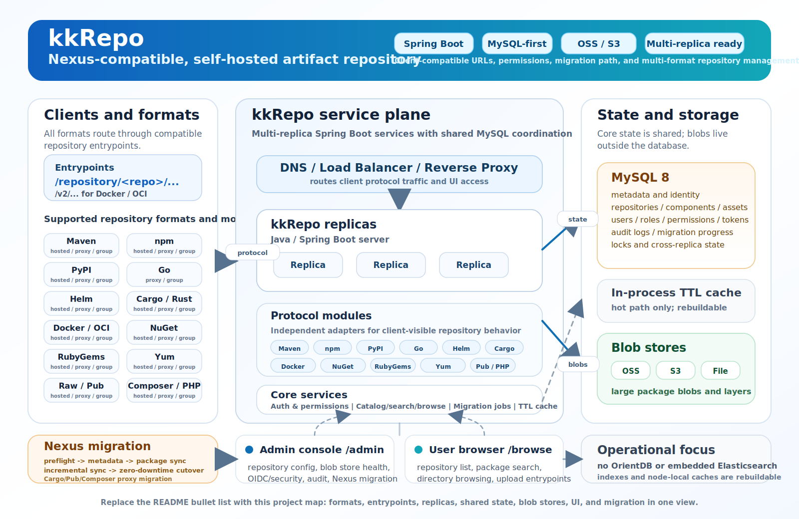
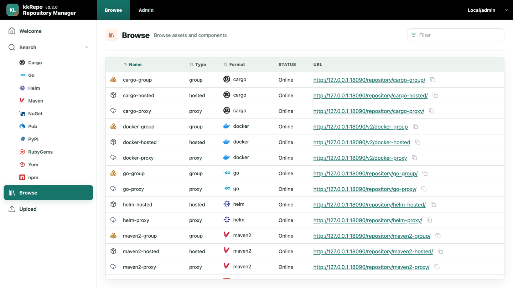
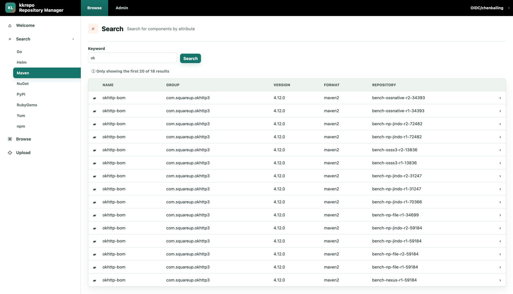
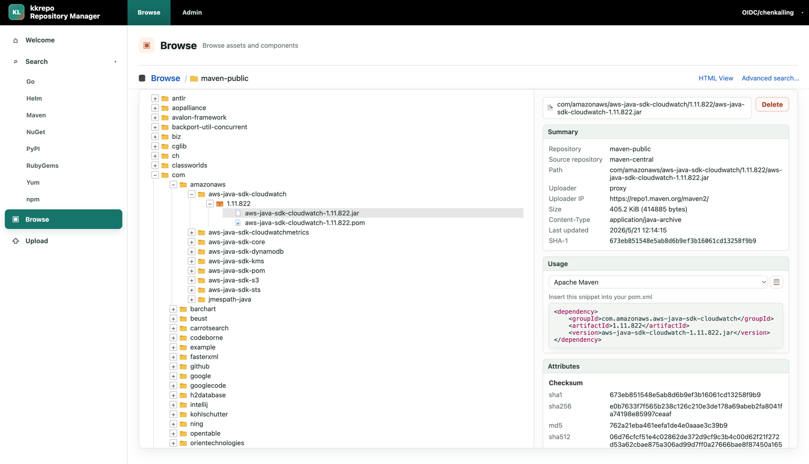
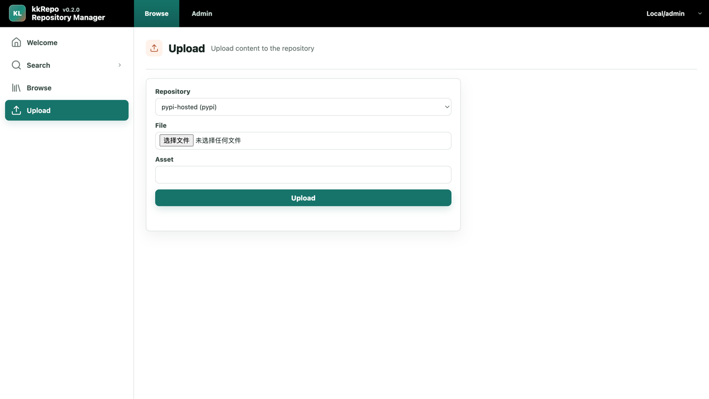
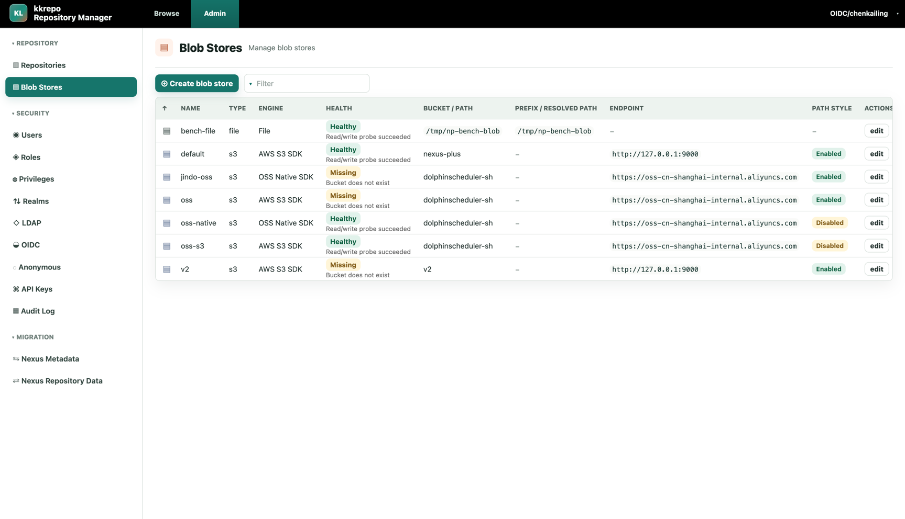
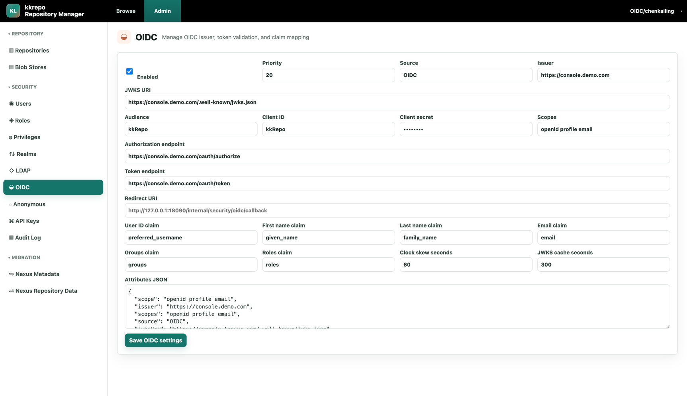
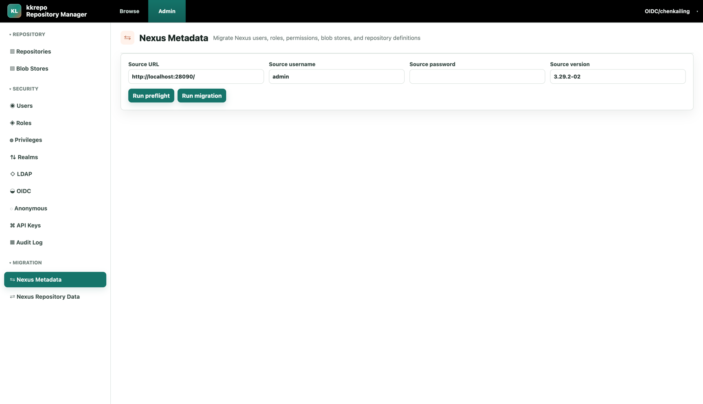
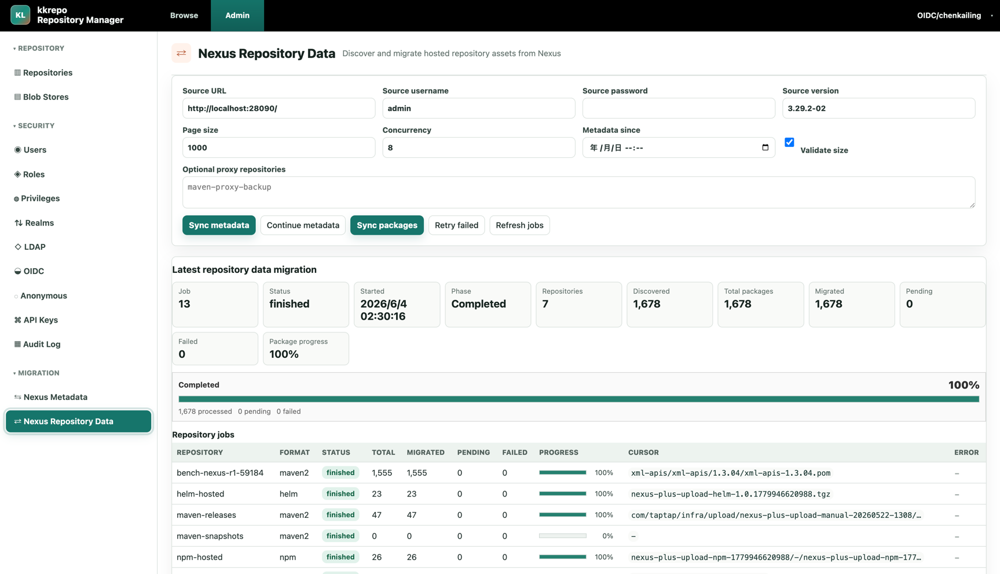

# kkRepo

[](https://github.com/klboke/kkrepo/actions/workflows/ci.yml)
[](https://codecov.io/gh/klboke/kkRepo)
[](https://github.com/klboke/kkrepo/releases)
[](LICENSE)
[](https://github.com/klboke/kkrepo/pkgs/container/kkrepo)
[](SECURITY.md)

**English** | [中文](README.cn.md)

kkRepo is a community-driven, fully open-source, self-hosted artifact repository designed to address the limitations and pain points of Sonatype Nexus Community Edition and provide the community with an open, reliable, and sustainably evolving artifact management solution. It currently supports Maven, npm, PyPI, Go, Helm, Cargo/Rust, Dart/Pub, Composer/PHP, Terraform, Swift Package Registry, Docker/OCI, NuGet, RubyGems, Yum, Raw, and other artifact formats.

## Features

- Support for 15+ mainstream repository formats across hosted, proxy, and group repository types.
- Compatibility with Sonatype Nexus APIs, user permission model, and the `/repository/<repo>/...` URL layout.
- Use kkRepo as a drop-in replacement for Sonatype Nexus, with one-click migration of existing data while preserving repository domains and URLs, so client configurations and CI workflows continue unchanged.
- Comprehensive identity and access control with Local, LDAP, and OIDC authentication, configurable anonymous access policies, and fine-grained permissions.
- Comprehensive observability with Prometheus metrics export and Grafana dashboards.
- MySQL or PostgreSQL-backed metadata and shared runtime state; MySQL remains the default.
- OSS/S3/File storage support for artifact blobs.
- Multi-replica high-availability deployment support.

<p align="center">
  
</p>

## Trademark Notice

Sonatype, Nexus, and Nexus Repository are trademarks of Sonatype, Inc. kkRepo is an independent open source project and is not affiliated with, endorsed by, sponsored by, or connected to Sonatype, Inc. References to Sonatype Nexus Repository are used only to describe compatibility, migration, or interoperability.

## Quick Start

Start a local trial environment with the public release image and MySQL:

```bash
curl -fsSL https://raw.githubusercontent.com/klboke/kkrepo/main/scripts/quickstart.sh | bash
```

To run the same image with the default PostgreSQL 16 quickstart instead (the runtime supports PostgreSQL 12+):

```bash
curl -fsSL https://raw.githubusercontent.com/klboke/kkrepo/main/scripts/quickstart.sh | KKREPO_DATABASE_TYPE=postgresql bash
```

Open:

- Admin console: `http://127.0.0.1:19090/admin/`
- User browser: `http://127.0.0.1:19090/browse/`
- Health check: `http://127.0.0.1:19091/actuator/health`

On the first visit, create the initial `Local/admin` administrator password in the UI. The quickstart uses File blob storage for local trials; use OSS/S3 and your own encryption secrets for production.

If you prefer to inspect the script before running it, download `scripts/quickstart.sh` first and then run it with `bash`.

## Build And Deployment

Local quick start, Spring Boot executable jar, Docker image, archive package, production deployment architecture, resource sizing, and upgrade flow are documented in the [Build And Deployment Guide](docs/en/build-deployment-guide.md).

If kkRepo is deployed behind Nginx or another HTTPS reverse proxy, follow the [Nginx Reverse Proxy Notes](docs/en/nginx-reverse-proxy.md) so generated repository URLs, such as npm `dist.tarball`, keep the public `https://` scheme and host.

Local hot-reload development and testing are documented in the [Development Guide](docs/en/development-guide.md).

## Supported Capabilities

| Format | Repository types | Client publish/upload | Browse and search | Nexus migration |
| --- | --- | --- | --- | --- |
| Maven | hosted / proxy / group | Maven deploy, PUT upload, and admin UI upload | Supported | Hosted repositories are migrated by default; proxy repositories can be migrated optionally |
| npm | hosted / proxy / group | `npm publish`, dist-tag, and admin UI upload | Supported | Hosted repositories are migrated by default; proxy repositories can be migrated optionally |
| PyPI | hosted / proxy / group | twine upload and admin UI upload | simple index supported | Hosted repositories are migrated by default; proxy repositories can be migrated optionally |
| Go | proxy / group | Go module proxy is mainly read-only proxy; hosted upload is not supported | Supported | Proxy repositories can be migrated optionally |
| Helm | hosted / proxy | chart push, PUT upload, and admin UI upload | index.yaml supported | Hosted repositories are migrated by default; proxy repositories can be migrated optionally |
| Cargo / Rust | hosted / proxy / group | `cargo publish`, yank/unyank, `CargoToken` auth, and UI/API `.crate` upload | Sparse index and `cargo search` supported | Cargo repository migration is supported |
| Dart / Pub | hosted / proxy / group | `dart pub publish`, `dart pub get`, `flutter pub get`, `PubToken` auth, and UI/API `.tar.gz` upload | Package/version metadata, archive attributes, and Pub search supported | Nexus 3.92.0 Pub hosted migration and explicitly selected proxy cache migration are supported |
| Composer / PHP | hosted / proxy / group | Composer has no standard publish command; Components API and UI zip/tar archive upload plus Composer 2 installation are supported | Package/version metadata, dist, HTML View, Browse/Search, and Usage supported | Native Nexus Composer proxy configuration is migrated; cache migration requires explicit administrator selection and a proven source profile |
| Terraform Provider / Module Registry | hosted / proxy / group | Nexus-compatible PUT and UI/API archive upload; `terraform init` resolves hosted and proxied modules/providers through groups | Module/provider coordinates, versions, platforms, Browse/Search, and Usage supported | Nexus Terraform hosted data and explicitly selected proxy archive caches are migrated; proxy/group configuration is also migrated |
| Swift Package Registry | hosted / proxy / group | `swift package-registry publish`, Basic/Bearer login, and UI/API source archive upload | Registry v1 release/manifest/archive metadata, Browse/Search, and Usage supported | Swift hosted data is `FULL` only for verified Nexus 3.92.x-3.94.x datastore shapes; drift and unavailable proxy secrets require manual action |
| Docker / OCI | hosted / proxy / group | Registry V2 login, hosted push/pull, proxy pull, group pull, OCI referrers, cleanup, and connector-port access | Manifest/tag/blob metadata supported | Hosted Docker repository data migration is supported through the Nexus Repository Data flow |
| NuGet | hosted / proxy / group | package push and admin UI upload | v3 service index / search supported | Hosted repositories are migrated by default; proxy repositories can be migrated optionally |
| RubyGems | hosted / proxy / group | gem push/yank and admin UI upload | Supported | Hosted repositories are migrated by default; proxy repositories can be migrated optionally |
| Yum | hosted / proxy / group | RPM upload and admin UI upload | repodata supported | Hosted repositories are migrated by default; proxy repositories can be migrated optionally |
| Raw | hosted / proxy / group | PUT upload and admin UI upload | Supported | Hosted repositories are migrated by default; proxy repositories can be migrated optionally |

Repository data migration scans hosted repositories by default. If you need to migrate proxy repositories from a source Sonatype Nexus Repository deployment as historical backup data or upstream cache data, explicitly specify repository names in `Optional proxy repositories` on the migration page. Cargo / Rust, Dart / Pub, native Nexus Composer, and Terraform proxy-cache migration are supported when explicitly selected and accepted by the source profile. Swift hosted archives, checksums, and manifests are restored only for Nexus 3.92.x-3.94.x sources whose datastore fingerprint proves the expected Swift content model; optional signatures, original metadata, and repository URL mappings are preserved only when the source export actually contains them. Native Nexus 3.94 accepts those optional publication fields but does not persist or re-expose them, so migration does not fabricate them. An out-of-range version, shape drift, or an unknown profile fails closed with a manual action. A Swift proxy whose source secret is masked or missing is created offline without a placeholder credential and must be completed explicitly in the target. Terraform restores module/provider archives through an independent proxy-cache writer and preserves Nexus public asset paths instead of replaying cache assets as hosted publications. Restored module archives can satisfy module download discovery without an upstream call; provider routes rebuild the verified checksum/signature snapshot from the configured upstream and pin its cached blobs for the metadata lifetime.

## Migrating From Sonatype Nexus Repository

Migration is available in the `/admin/` console:

1. Enable Script REST API script creation on the source Sonatype Nexus Repository deployment.
2. On the `Nexus Metadata` page, run `Run preflight` first, then run `Run migration` after blocking issues are resolved.
3. On the `Nexus Repository Data` page, run `Sync metadata` to migrate repository metadata, then run `Sync packages` to migrate the real blob data.
4. For the first repository data migration, leave `Metadata since` empty to scan all data. Later runs can set `Metadata since` for incremental migration.
5. After migration is complete, point the original repository domain to kkRepo. Non-Docker clients can keep the same `/repository/<repo>/...` URLs; Docker clients should keep the same `/v2/...` registry entrypoint, repository names, and connector/path-based routing shape.

Migration supports interruption and resume. Completed data is skipped on later runs. See the [Nexus Migration Guide](docs/en/nexus-migration-guide.md) for the full process.

## Compatibility And Migration Context

| Dimension | Sonatype Nexus Repository OSS / Community Edition | kkRepo |
| --- | --- | --- |
| Product positioning | A general-purpose artifact repository management platform with broad format and management coverage | Provides migration-oriented client behavior, permission model, and `/repository/<repo>/...` URL compatibility while using a relational-database, OSS/S3-first, multi-replica-friendly architecture |
| Supported formats | Officially supports more formats; exact capabilities vary by version and distribution | Focuses on common artifact formats. Currently supports Maven, npm, PyPI, Go, Helm, Cargo/Rust, Dart/Pub, Composer/PHP, Terraform, Swift Package Registry, Docker/OCI, NuGet, RubyGems, Yum, and Raw. Each format is implemented as an independent protocol module for prioritized extension and validation |
| Usage limits | Community Edition targets individuals and small teams. Official limits are up to 40,000 components and 100,000 requests/day. When exceeded, new component creation is paused until usage returns below the limits | Does not include Community Edition-style license usage limits. Capacity is bounded by the selected relational database, OSS/S3, replica count, and deployment sizing, so it can scale with actual business needs |
| High availability deployment | Open source editions are suitable for a single instance or basic Kubernetes deployment; official HA deployment is a Pro capability | Designed for multi-replica deployment by default: session, authentication tickets, catalog watermarks, locks, migration progress, and short-lived coordination state are stored in MySQL or PostgreSQL. In-process cache is only a rebuildable hot cache |
| Stability and upgrade | Version boundaries are complex: 3.70.x is the last version supporting OrientDB; 3.71.0 defaults new installs to H2, but H2 is still embedded; Community Edition did not support free external PostgreSQL until 3.77.0+; search was fully moved to SQL and away from Elasticsearch only in 3.88.0. Older OrientDB/Elasticsearch/local-data-directory deployments carry heavy upgrade windows and recovery depends heavily on backups, repair tasks, and manual intervention | MySQL/PostgreSQL runtime with no dependency on OrientDB or embedded Elasticsearch. Core state is in the shared relational database, blobs are in OSS/S3/File blob store, and cache/index data is rebuildable, making rolling upgrade, failover, and recovery easier |
| Metadata storage | Historical versions moved across OrientDB, H2, PostgreSQL, and related migration paths. Older instances must handle database migration constraints during upgrade | Repositories, components, assets, permissions, tokens, audit logs, migration state, and rebuildable indexes use explicit MySQL or PostgreSQL table structures for easier troubleshooting, governance, and horizontal scaling |
| Blob storage | Common deployments use local file blob store; object storage availability depends on version and configuration | OSS/S3-first, with File blob store retained for development and testing. The relational database stores only metadata, state, indexes, and references, not large blobs |
| Search and indexing | Before 3.88.0, Nexus search and indexing were based on embedded Elasticsearch, with index files and database state separated. Index corruption or inconsistency requires Nexus repair/rebuild tasks | Uses relational-database denormalized indexes and protocol-derived metadata. browse/search/index data is designed to be rebuildable, and node-local cache loss does not affect correctness |
| Architecture complexity | Nexus Repository is feature-rich and carries many general management capabilities and historical architecture mechanisms | kkRepo keeps the architecture simple and focuses on repository management and client protocol implementation |

## Selection Guidance

- If your business scale is very small, package count and traffic are within Community Edition limits, and occasional maintenance downtime is acceptable, the open source Sonatype Nexus Repository edition may be sufficient.
- If stability, scalability, and multi-replica deployment matter, or if you manage a large number of packages, kkRepo is designed for that deployment shape.
- If an existing Sonatype Nexus Repository instance runs into component-count or daily-request limits after upgrading to a newer Community Edition version, kkRepo provides a one-click migration flow designed for zero-downtime migration.

## UI Overview

### User UI

The user UI is for artifact consumers. It provides repository lists, package search, directory browsing, artifact details, and upload entrypoints.

The repository list shows hosted, proxy, and group repositories with format, status, and access URLs so users can copy client configuration URLs directly.



Search components by format across Maven, npm, PyPI, Go, Helm, Cargo/Rust, Dart/Pub, Composer/PHP, Terraform, Swift Package Registry, Docker/OCI, NuGet, RubyGems, Yum, Raw, and other repository types.



Directory browsing shows repository path trees, artifact summaries, checksums, content type, update time, and client usage snippets.



The upload page lets users select a repository, upload files, and set asset paths for manual publishing to hosted repositories.



### Admin UI

The admin UI is for repository administrators and focuses on repository configuration, storage health, security configuration, audit, and migration.

The Blob Store page supports OSS Native SDK, AWS S3 SDK, and File engines, and shows read/write probe health.



The OIDC page manages issuer, JWKS, client, scope, claim mapping, and token validation parameters for integrating with centralized identity systems.



The Nexus Metadata migration page migrates users, roles, privileges, blob stores, and repository definitions, and supports preflight checks.



The Nexus Repository Data migration page shows hosted repository data migration tasks, concurrency settings, progress statistics, failure counts, and per-repository details.



AI agent and contributor development instructions are in [AGENTS.md](AGENTS.md).

## Roadmap

Platform infrastructure roadmap:

1. ✅ PostgreSQL database backend - Implemented through the public `persistence-jdbc` contracts, semantic dialect SPIs, backend-owned Flyway migrations, dual-database contract tests, and multi-replica server smoke tests. MySQL remains the default backend ([database backend guide](docs/en/database-backends.md), [Chinese design plan](docs/zh/dev/pluggable-database-access-layer-design.md)).

Repository format roadmap:

1. ✅ Docker / OCI Registry - Completed ([implementation notes](docs/en/dev/docker-repository-implementation-plan.md))
2. ✅ Cargo / Rust - Repository support completed, including search, UI/API upload, and migration ([design notes](docs/en/dev/cargo-rust-repository-design.md))
3. ✅ Dart / Pub - Repository support completed, including hosted/proxy/group, client E2E, UI/API upload, search, and Nexus migration ([Chinese design notes](docs/zh/dev/dart-pub-repository-design.md))
4. ✅ Composer / PHP - Hosted, proxy, group, UI/API upload, search, real-client E2E, required Nexus live comparison, and explicitly selected Nexus proxy-cache migration E2E implemented ([Chinese design notes](docs/zh/dev/composer-php-repository-design.md))
5. ✅ Terraform Provider / Module Registry - Hosted, proxy, group, provider GPG signing, Nexus-compatible paths, UI/API upload, search, real Terraform CLI E2E, Nexus hosted-data migration, and explicitly selected proxy-cache migration implemented ([Chinese design notes](docs/zh/dev/terraform-repository-design.md))
6. ✅ Swift Package Registry - Hosted, GitHub-backed proxy, group, Registry v1, immutable signed publication, UI/API upload, Browse/Search, multi-replica coordination, real SwiftPM/Xcode E2E, and shape-gated Nexus 3.92.x-3.94.x migration are implemented ([Chinese design notes](docs/zh/dev/swift-package-registry-design.md))
7. ohpm / HarmonyOS - Planned with hosted, proxy, group, import, and admin capabilities ([Chinese design notes](docs/zh/dev/ohpm-repository-design.md))
8. APT / Debian
9. Conan
10. Conda

Token types exposed in the user and admin UI include protocol-specific tokens (`NpmToken`, `CargoToken`, `PubToken`, `NuGetApiKey`, `RubyGemsApiKey`) plus `GenericToken` for Terraform service URLs, CI, scripts, and custom HTTP clients that can send the configured API-key header or bearer token.

## Contributing

Issues and pull requests are welcome. See [CONTRIBUTING.md](CONTRIBUTING.md) for the contributor workflow, PR expectations, compatibility testing expectations, and multi-replica design constraints. Community behavior expectations are documented in [CODE_OF_CONDUCT.md](CODE_OF_CONDUCT.md).

Local development and testing are documented in the [Development Guide](docs/en/development-guide.md). Build and deployment are documented in the [Build And Deployment Guide](docs/en/build-deployment-guide.md). AI agent and contributor constraints are in [AGENTS.md](AGENTS.md).

## Support

Join the [kkRepo Telegram group](https://t.me/+UbIsTKXTzxBhYjFl) for community support and usage discussion. See [SUPPORT.md](SUPPORT.md) for issue routing, support scope, and security-reporting boundaries.

## Security

If you find a security issue, follow [SECURITY.md](SECURITY.md) and report it through GitHub Security Advisory first. Avoid disclosing exploitable details in public issues. Regular bugs, compatibility issues, and feature requests can be submitted as public issues.

## License

kkRepo is open sourced under the [Apache License 2.0](LICENSE).

## Documentation

- [Development Guide](docs/en/development-guide.md)
- [Build And Deployment Guide](docs/en/build-deployment-guide.md)
- [Nginx Reverse Proxy Notes](docs/en/nginx-reverse-proxy.md)
- [Client Recipes](docs/en/client-recipes.md)
- [Architecture](docs/en/architecture.md)
- [Compatibility Matrix](docs/en/compatibility-matrix.md)
- [Troubleshooting Guide](docs/en/troubleshooting.md)
- [Production Hardening Guide](docs/en/production-hardening.md)
- [Backup And Restore Guide](docs/en/backup-restore.md)
- [Security Model](docs/en/security-model.md)
- [MySQL ER Design](docs/en/mysql-er.md)
- [Database Backends](docs/en/database-backends.md)
- [Database Schema](docs/en/database-schema.md)
- [Nexus Migration Guide](docs/en/nexus-migration-guide.md)
- [Nexus Migration Playbook](docs/en/migration-playbook.md)
- [Monitoring And Observability Guide](docs/en/monitoring-observability-guide.md)
- [Nexus Compatibility Testing](docs/en/nexus-compatibility-testing.md)
- [FAQ](docs/en/faq.md)
- [Why We Built kkRepo](docs/en/why-kkrepo.md)
- [Changelog](CHANGELOG.md)
