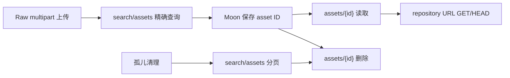

# Moon Windows 主链路 Nexus 兼容改造记录

## 1. 结论

记录日期：`2026-07-28`；SIT 双端验证更新：`2026-07-29`；历史 public ID 改造更新：`2026-07-29`

本次已完成 kkRepo 侧 Moon Windows 主链路所需的 Nexus 管理 API 最小兼容实现，并补齐 Raw 资产按 ID 删除、权限、审计、稳定分页、数据库索引和跨副本缓存失效。当前结论如下：

| 项目 | 状态 | 结论 |
| --- | --- | --- |
| 代码实现 | `COMPLETE` | Moon 当前源码实际使用的 `search/assets`、asset GET/DELETE、Maven group GET 已实现 |
| 聚焦单元测试 | `PASS` | 55 tests，0 failures，0 errors，0 skipped |
| 历史 Nexus public asset ID 改造 | `COMPLETE` | 已实现统一 ID 注册表、冲突隔离、删除 tombstone、迁移采集与只回填模式；代码尚未部署 SIT |
| 历史 ID 聚焦测试 | `PASS` | server 聚焦测试与 Nexus REST 客户端测试均为 0 failures、0 errors、0 skipped；详见 6.6 |
| 黑盒测试编译 | `PASS` | `MoonWindowsManagementBlackBoxCompatibilityTest` 已通过 reactor `test-compile` |
| MySQL/PostgreSQL Testcontainers | `BLOCKED` | 测试源码已编译，但本机 Testcontainers 在容器启动前因 Docker 探测配置异常退出，V36 未在真实数据库执行 |
| Nexus/kkRepo 双端实测 | `PASS` | 新 SIT `172.28.227.60:8080` 与 Nexus `10.1.11.19:8081` 完成 3 项黑盒用例，0 failures、0 errors、0 skipped |
| 已同步 Windows 资产只读验证 | `阶段性 PASS` | `windows-artifacts` 迁移任务 38/38、0 失败且路径与 SHA-1 对齐；`windows-components` 在 98 条交集快照上 SHA-1 全部对齐，并完成分页、HEAD 和代表性完整下载验证 |
| 生产切换 | `NO-GO` | 历史 ID 代码尚未部署和回填；`windows-components` 全量对账、多副本验证和真实 MySQL 8 的 V36 验证也尚未完成 |

这里的 `双端实测 PASS` 是历史 ID 改造前部署版本的既有 API 证据，不代表新注册表和历史 ID 回填已经在 SIT 通过。`阶段性 PASS` 只适用于测试时已经同步且实际核验的资产，不等于全量迁移验收通过。在 Windows 历史资产 ID 回填、全量资产对账和多副本验证完成前，不应把 Nexus DNS 直接切换到 kkRepo。

## 2. Moon 实际调用链

证据来自公司 Sourcegraph 中 `gitlab.qunhequnhe.com/moon/moon` 的实际源码。复核时仓库 HEAD 为：

```text
0968373080789bc82338b96f3f1cac69239f1f8b
```

未使用 SDK 方法名猜测参数。`AutoDeleteWindowsArtifacts` 的完整调用实参确认只使用 `continuationToken`、`repository` 和 `name` 三类 search 参数。

| 调用位置 | 实际调用 | 业务作用 |
| --- | --- | --- |
| `api/.../WindowsConstant.java:29-30` | `GET /service/rest/v1/search/assets?repository=...&name=...` | Windows 发布结果校验、按仓库和路径定位资产；这里仍硬编码 Nexus 域名 |
| `web/.../NexusManagementService.java:61` | `GET /service/rest/v1/repositories/maven/group/{repositoryName}` | 读取 Maven group 配置 |
| 同文件 `:69` | `GET /service/rest/v1/assets/{id}` | 根据 Moon 保存的 asset ID 读取下载地址 |
| 同文件 `:77` | `DELETE /service/rest/v1/assets/{id}` | 根据 asset ID 删除资产 |
| `web/.../AutoDeleteWindowsArtifacts.java:151` | `searchAssets(... repository, ... name, ...)` | 根据制品 URL 提取 path，精确查找 Raw 资产 |
| 同文件 `:198` | `AssetsApi.deleteAsset(id)` | 删除过期资产 |
| 同文件 `:295,319,326-327` | `searchAssets(continuationToken, ... repository, ...)` | 分页扫描孤儿资产 |
| 同文件 `:304` | `AssetsApi.deleteAsset(id)` | 删除孤儿资产 |
| 同文件 `:204-219` 附近 | `HEAD {downloadUrl}` | 判断制品是否已经是 404 |
| `WindowsComponentVersionServiceImpl.java:126,140,182` | asset GET/DELETE | Windows 组件版本查询、删除和下载 |
| `WindowsComponentReleaseServiceImpl.java:185` | asset GET | Windows 发布读取下载地址 |

主链路可以归纳为：



## 3. 本次范围与兼容状态

| API/行为 | 本次处理 | 当前状态 |
| --- | --- | --- |
| `GET /service/rest/v1/search/assets` | 支持 `repository`、`name`、`continuationToken`；50 条 keyset 分页 | 双端 exact/空页 PASS；`bolero` 和已迁移的 `windows-components` 前两页均为 50+50，token 连续且页间无重复 ID |
| `GET /service/rest/v1/assets/{id}` | 通过统一注册表解析 kkRepo 原生 ID 和 Nexus 历史 ID，返回 Nexus AssetXO 所需字段并执行 READ 鉴权 | 新旧 ID 解析代码与单测 PASS；历史 ID 的 SIT 双端验证待部署后执行 |
| `DELETE /service/rest/v1/assets/{id}` | 通过统一注册表精确定位资产；Raw hosted 删除后保留 ID tombstone，并执行审计和缓存失效 | 原生 ID 删除闭环既有双端 PASS；历史 ID 删除的 SIT 双端验证待执行 |
| `GET /service/rest/v1/repositories/maven/group/{repositoryName}` | 返回 Nexus 3.27 实测字段集合 | `maven-public` DTO/成员顺序及 `200/403/401` 认证语义双端 PASS |
| `POST /service/rest/v1/components` | 复用已有 Raw component upload；新增公司 multipart 形状的闭环黑盒场景 | 双端 Raw multipart 上传 `204` PASS |
| `GET/HEAD /repository/{repo}/{path}` | 复用现有 Raw 内容服务；闭环黑盒场景覆盖下载、checksum 和 HEAD | 双端下载内容、checksum 与 HEAD `200` PASS |

明确不在本次范围内：

- `search/assets` 的 Maven 坐标、Docker、npm 等 Nexus 全量查询参数。
- 非 Raw hosted 仓库的 asset DELETE。当前明确返回 `405`，不伪装为已支持。
- Nexus 全量 Search API、Component API 和其它管理 API。
- Nexus 内部 OrientDB identity 到 REST public ID 的推导。实现只采信 Nexus REST `search/assets` 实际返回的 public ID，不把内部 identity 当成外部 ID。

## 4. Nexus 参考行为

参考端为 `http://10.1.11.19:8081`，已确认版本为 Nexus Repository OSS `3.27.0-03`。`2026-07-29` 的写入验证仅使用双方已有的 Raw hosted 测试仓库 `zhuyang-test` 和唯一测试路径，未写入 `windows-artifacts`、`windows-components` 等业务仓库；测试资产已通过 API 删除并完成残留扫描。

| 场景 | Nexus 参考结果 | kkRepo 实现 |
| --- | --- | --- |
| 不存在仓库的 asset search | `200`，`{"items":[],"continuationToken":null}` | 同语义；专门锁定 null 字段序列化 |
| 非法 asset ID | `422`，空响应体 | 同语义 |
| AssetXO 字段 | `downloadUrl`、`path`、`id`、`repository`、`format`、`checksum` | 同字段集合 |
| 常见 checksum | `sha1`、`md5`，部分历史资产还有 `sha256` | 按数据库已有值返回这三类 checksum |
| Maven group GET | `name`、`online`、`storage`、`group`；3.27 响应没有 `maven` 字段 | 同字段集合，不臆造 `maven` |
| Maven group 认证语义 | 管理员 `200`、匿名 `403`、错误凭据 `401` | 三种状态与 Nexus 完全一致 |

Nexus 实际 asset ID 的 Base64 URL-safe 解码结构已确认是：

```text
{repositoryName}:{32 位小写十六进制 opaque value}
```

kkRepo 沿用相同外形。原生 opaque ID 默认由 MySQL `asset.id` 生成，发生历史 alias/tombstone 冲突时改用随机 128 位值；所有解析都通过 V36 注册表完成。两端都把 ID 视为 opaque，不能从编码外形推导数据库主键或历史映射。

## 5. 实现设计

### 5.1 Asset ID 与分页

- kkRepo asset ID 使用无 padding 的 Base64 URL-safe 编码。
- payload 为 `{repositoryName}:{32 位小写十六进制 opaque ID}`；opaque ID 不再被直接解析为 MySQL `asset.id`。
- GET/DELETE 解码后只按 `(repository_id, opaque_id)` 查询统一注册表，命中且 `asset_id` 非空才访问资产。
- 格式非法返回 `422`；格式合法但未知、跨仓库或已删除 tombstone 返回 `404`。
- search 始终返回 kkRepo 原生 public ID，历史 Nexus alias 只用于兼容 Moon 已保存的旧 ID。
- 不采用“先查历史映射，再把 opaque ID 解析为新主键”或相反顺序的兜底。两套 ID 空间可能出现相同 32 位值，顺序兜底会把请求静默路由到错误资产。
- continuation token payload 为 `v1:{16 位 repository.id}:{16 位 lastAssetId}`。
- token 与具体 repository 绑定；跨仓库复用返回 `400`。
- 分页使用 `(repository_id, id)` keyset，不使用 offset，避免删除或新增数据时发生大范围漂移。
- ID 和 token 不保存在 JVM 中，重启和多副本使用同一 MySQL 真相。

### 5.2 Search 行为

- `repository` 是 Moon 范围内的必填参数。
- `repository + name` 对 Raw 资产执行 path 精确查询，返回 0 或 1 条。
- 只传 `repository` 时按 `asset.id` 升序返回，每页最多 50 条。
- 只接受 Moon 已被源码证明使用的 `repository`、`name`、`continuationToken`；其它参数返回 `400`，防止把未实现参数误报为兼容。
- 不存在的 repository 返回 Nexus 同形空页。
- 已存在 repository 的查询执行 BROWSE 权限判定。

### 5.3 GET、DELETE 与生命周期

- GET 按 opaque ID 精确读取 asset 与 live blob 元数据，并执行 READ 权限判定。
- DELETE 先解析 ID、确认资产归属，再执行 DELETE 权限判定。
- DELETE 当前仅支持 Raw hosted，避免错误复用到需要协议 metadata 重建的 Maven/npm 等格式。
- 一个 MySQL 事务内删除 browse node、asset，并在 component 无资产时删除空 component。
- blob 不在线硬删除；无引用后标记为 deleted，由现有 GC 异步删除 OSS/S3 对象。
- 并发重复删除依据数据库影响行数判定，只有一个请求返回成功，不依赖 JVM 锁。

### 5.4 权限与审计

- 复用请求中已有主体，或从请求凭据认证。
- 仅在请求没有显式凭据时尝试 anonymous；错误凭据不会降级为 anonymous。
- asset search/get/delete 分别使用 BROWSE、READ、DELETE repository permission。
- Maven group GET 使用 `nexus:repository-admin:maven2:{repo}:read`。
- 请求中附加 repository 与 requested permission 上下文，供审计记录使用。
- `DELETE /service/rest/v1/assets/*` 已纳入 `ManagementAuditFilter` 非读操作审计。

### 5.5 多副本缓存语义

- MySQL asset/blob 行是业务真相，节点本地缓存只保存可重建快照。
- 写入、覆盖和删除在事务提交后失效本节点资产缓存。
- `AssetMetadataCache` 现在同时更新 MySQL `VersionWatermark`。
- 其它副本读取时比较 repository 版本；版本变化后清空该 repository 的本地资产缓存并回源 MySQL。
- 版本水位读取仍有现有本地短 TTL，用于降低 MySQL 压力；资产缓存 TTL 是漏通知时的最后兜底。
- 新增双节点单测使用两个独立本地缓存和同一个版本水位，证明写节点失效后读节点不继续使用旧快照。

### 5.6 数据库变更

新增 Flyway V35：

```sql
CREATE INDEX idx_asset_repository_id ON asset (repository_id, id);
```

MySQL 与 PostgreSQL 迁移均已增加。该索引用于 repository 范围内的 asset ID keyset 分页；不是 format 索引的重复替代。

新增 Flyway V36：`asset_public_identifier`。

| 字段/约束 | 作用 |
| --- | --- |
| `UNIQUE(repository_id, opaque_id)` | 同一仓库内一个外部 ID 永远只能注册一次，原生 ID 与 Nexus alias 共享同一冲突域 |
| `UNIQUE(native_asset_id)` | 每个存活资产最多只有一个 kkRepo 原生 public ID |
| `asset_id` | 外部 ID 当前指向的资产；资产删除时 FK `ON DELETE SET NULL` |
| `native_asset_id` | 仅原生 ID 使用；资产删除时同样置空 |
| `identifier_type` | 区分 `KKREPO_NATIVE` 与 `NEXUS_ALIAS` |
| `source_instance`、`migration_job_id` | 记录 alias 来源与迁移任务，便于追溯；`migration_job_id` 不设 FK，避免清理任务时丢失证据 |

V36 会为所有现有 asset 回填 `{asset.id}` 对应的 32 位原生 opaque ID。资产删除后注册表行不删除，`asset_id` 置空形成 tombstone，旧 ID 永不复用。若某个原生候选值已被 Nexus alias 或 tombstone 占用，kkRepo 为该资产生成随机 128 位 opaque ID；数据库唯一约束负责最终并发仲裁。注册路径使用 `SELECT ... FOR UPDATE` 当前读，避免 MySQL `REPEATABLE READ` 在唯一键冲突后仍读取旧快照。因此新的原生 ID 与旧 Nexus ID 即使数值相同，也不会查到错误资产。

### 5.7 Nexus public ID 采集与回填

迁移管理 API 和管理 UI 增加两个显式开关：

- `captureNexusPublicAssetIds=true`：正常迁移时采集 public ID。目标资产已存在时在发现阶段回填；新下载资产在写入完成后回填。
- `publicIdBackfillOnly=true`：只为目标端已有资产回填 public ID，自动启用采集；目标资产缺失时直接把该项标记失败，不下载 blob，也不隐式补数据。

每次注册 alias 前必须同时满足：Nexus exact search 去重后恰好得到一个 public ID、repository 完全一致、path 完全一致、Nexus 与 kkRepo SHA-1 一致。任何缺项、多个不同 public ID、SHA-1 不一致或 ID 已属于其它资产/tombstone，均停止该项并记录失败。凭据只通过迁移任务的既有加密字段传入，不写入 Git、日志或本文档。

## 6. 测试与实际结果

### 6.1 已执行：聚焦单元测试

实际执行环境：JDK `D:\jdk\jdk25`。由于本机 Maven 全局镜像不可达，测试时临时使用了 `target/codex-settings.xml` 指向公开镜像；该临时文件在任务结束前删除。

```powershell
mvn -s target\codex-settings.xml -pl server -am `
  "-Dtest=NexusAssetIdCodecTest,NexusAssetManagementServiceTest,NexusRepositoryManagementAuthorizerTest,NexusRepositoryManagementControllerTest,RawHostedServiceTest,RawAssetWriterTest,ManagementAuditFilterTest,AssetMetadataCacheTest" `
  "-Dsurefire.failIfNoSpecifiedTests=false" test
```

结果：

```text
Tests run: 55, Failures: 0, Errors: 0, Skipped: 0
BUILD SUCCESS
```

覆盖内容包括 ID/token 编解码、分页、空页 null 序列化、DTO、权限、Raw-only 删除、并发重复删除、审计和跨副本缓存版本失效。

### 6.2 已执行：黑盒测试编译

```powershell
mvn -s target\codex-settings.xml -pl compat-test -am -DskipTests test-compile
```

结果为 `BUILD SUCCESS`。这只能证明测试源码可以编译，不能记为双端 PASS。

### 6.3 未执行：MySQL/PostgreSQL 数据库集成测试

V36 新增的数据库用例覆盖唯一约束、同事务内重复注册、资产删除后的 tombstone，以及 Flyway 升级到 V36。MySQL 和 PostgreSQL 测试源码均已成功编译，但本机 Testcontainers 在容器启动前失败：

```text
java.nio.file.InvalidPathException: Illegal char <"> at index 0: "
```

本机 Docker CLI 同时无法连接 `npipe:////./pipe/docker_engine`。因此以下测试均未进入数据库初始化或执行 V36 SQL，状态只能记录为 `BLOCKED`，不能记录为 PASS 或兼容性 FAIL：

- MySQL：`AssetDaoMySqlIntegrationTest`、`MySqlV29MigrationCompatibilityTest`
- PostgreSQL：`AssetPublicIdentifierPostgreSqlIntegrationTest`、`PostgreSqlMigrationCompatibilityTest`

### 6.4 已执行：双端 live 闭环

黑盒类：

```text
compat-test/src/test/java/com/github/klboke/kkrepo/compat/
MoonWindowsManagementBlackBoxCompatibilityTest.java
```

测试端点：

- Nexus 参考端：`http://10.1.11.19:8081`
- kkRepo SIT：`http://172.28.227.60:8080`

凭据仅在执行进程中通过环境变量注入，未写入代码、Git 或本文档。

第一次执行时 Nexus 被设置为只读，结果为 3 tests / 1 failure；唯一失败是 Nexus Raw 上传返回 `503`。管理员解除只读后重新执行，正式结果为：

```text
Tests run: 3, Failures: 0, Errors: 0, Skipped: 0
BUILD SUCCESS
```

通过场景：

1. 不存在仓库 search 返回 Nexus 同形空页。
2. 非法 asset ID 双端返回 `422`。
3. 使用公司真实 Raw multipart 字段上传：`raw.directory`、`raw.asset1`、`raw.asset1.filename`。
4. 双端 upload -> exact search -> asset GET -> download -> checksum -> HEAD -> DELETE -> 删除后 GET/search。
5. Maven group DTO 与成员顺序对比。
6. 管理员、匿名和错误凭据的 Maven group 状态分别为 `200`、`403`、`401`，与 Nexus 一致。
7. 测试资产通过 finally 清理，双端测试命名空间残留扫描均为 0。

写测试默认拒绝 `windows-artifacts`，仅允许专用 `moon-windows-compat`。只有同时显式设置以下开关才允许写生产同名仓库：

```text
COMPAT_WRITE_ENABLED=true
COMPAT_MOON_ALLOW_PRODUCTION_REPOSITORY=true
```

写入闭环只使用双方已有的 Raw hosted 测试仓库 `zhuyang-test` 和唯一测试路径，没有向 `windows-artifacts` 或 `windows-components` 写入或删除数据。首次 Nexus 只读造成的 `503` 是无效环境轮次，不计为 kkRepo 兼容失败。

### 6.5 已执行：已同步 Windows 资产阶段性只读验证

验证日期：`2026-07-29`。测试期间同步任务仍在运行，因此组件数量是带时间戳的过程快照，不是最终迁移数量。对业务仓库仅执行 GET、HEAD 和 search，没有上传、覆盖或删除。

#### 6.5.1 路径集合与元数据校验

`11:00:38 +08:00` 至 `11:00:45 +08:00` 的稳定快照：

| 仓库 | Nexus 响应项 | kkRepo 响应项 | 双端同路径 | SHA-1 一致 | SHA-1 不一致 | kkRepo 独有路径 |
| --- | ---: | ---: | ---: | ---: | ---: | ---: |
| `windows-artifacts` | 38 | 20 | 20 | 20 | 0 | 0 |
| `windows-components` | 1624 | 98 | 98 | 98 | 0 | 0 |

`11:11:19 +08:00` 再次核验时，`windows-artifacts` 已达到双方 38/38，38 条路径与 SHA-1 全部一致，无双端独有路径。`windows-components` 仍持续增长，不使用运行中的跨时点计数作为最终验收依据。

Nexus 的 `windows-components` 全量分页在一次快照中返回 1624 项、1623 个唯一 path；重复项的 path、ID、checksum 和 download URL 完全相同。这是来源端分页响应中的重复项，计数对账应以唯一 path 和逐 path 精确查询为准。

`11:15:57 +08:00` 的迁移任务状态：

| Job | 仓库 | 状态 | 已发现 | 已迁移 | 失败 | 待处理 |
| ---: | --- | --- | ---: | ---: | ---: | ---: |
| 5 | `windows-artifacts` | `finished` | 38 | 38 | 0 | 0 |
| 4 | `windows-components` | `running` | 1617 | 176 | 0 | 1441 |

`windows-components` 的 job 4 已发现 1617 条，比本次来源端全量分页观察到的 1623 个唯一 path 少 6 条。迁移完成后必须使用冻结清单找出并补齐差集，不能仅凭 job 4 进入 `finished` 就判定全量完成。

额外 REST 流式同步 `windows-artifacts` 的结果为 5 条上传、32 条 checksum 已一致跳过、1 条传输中断。中断路径 `com/qunhe/maxservice/maxservice-86b25896-20260714011530795.zip` 已由并行迁移写入目标端；随后精确复核两端均为 1 条、SHA-1 均为 `7c5e70c0ddb9c4ae6bde22be724549b3f5e5c346`、HEAD 均为 `200`、长度均为 594567974 字节。因此该记录是冗余传输尝试失败，不是目标资产缺失；原始失败计数仍在本文保留。

#### 6.5.2 HEAD、有效 ID 与完整内容校验

- 从两仓库各取 20 条交集资产，共 40 条执行双端 HEAD；40/40 的状态均为 `200`，`Content-Length` 和 `Content-Type` 全部一致。
- 两个代表性制品执行双端完整流式下载，不落本地磁盘；响应体 SHA-1 与双方 search 元数据 SHA-1 均一致。
- 两个样本在双方使用各自有效 asset ID 执行 `GET /service/rest/v1/assets/{id}`，均返回 `200`。

| 仓库 / 路径 | 字节数 | Content-Type | SHA-1 | 结论 |
| --- | ---: | --- | --- | --- |
| `windows-artifacts/com/qunhe/dcsmesh-occ/dcsmesh-occ-68a98268-20260529082346277.zip` | 205991281 | `application/zip` | `70d02c5850d25dc8cb16e90c612404cf887e853e` | 双端响应体与元数据一致 |
| `windows-components/fxaa/fxaa-1.3.5.exe` | 11596800 | `application/x-executable` | `66c5cfd95d0d5174806a42b3a636bb8f94fad3d4` | 双端响应体与元数据一致 |

#### 6.5.3 真实业务仓库分页

`windows-components` 在两端的前两页均返回 50+50 项，两端第一页和第二页均提供 continuation token，页间重复 ID 均为 0。`windows-artifacts` 达到 38 条后单页返回 38 项且 token 为 null。

#### 6.5.4 已确认的限制

- 在历史 ID 改造代码部署前，将上述两个制品的 Nexus 历史 asset ID 直接请求当前 kkRepo SIT，均返回 `422`。这是旧部署版本的有效失败证据；新代码尚未部署，因此不能用单元测试覆盖或改写该双端结果。
- 一次试图对迁移中的全部已发现组件逐项执行 HEAD 的扩展扫描，在第 60 秒遇到单请求超时并中止；该轮不计为 PASS。本文只把已完整结束且有明确计数的 40 条 HEAD 和 2 条完整下载列为有效证据。
- 迁移任务与额外 REST 流式同步同时运行时，任务内部计数可能暂时小于仓库实际资产数；最终验收必须在同步停止后重新冻结快照并按唯一 path 全量核验。

### 6.6 已执行：历史 public ID 改造静态验证

server 聚焦测试覆盖完整 128 位 opaque ID、统一注册表解析、冲突后随机原生 ID、alias 幂等、tombstone 禁止复用、GET 可写事务补偿、迁移采集校验、正常迁移采集、已有资产只回填和缺失资产禁止下载。结果：

```text
Tests run: 54, Failures: 0, Errors: 0, Skipped: 0
BUILD SUCCESS
```

Nexus REST 客户端对 exact search、URL 编码、无关项过滤和重复项折叠的测试结果：

```text
Tests run: 15, Failures: 0, Errors: 0, Skipped: 0
BUILD SUCCESS
```

以上仅证明代码级行为。V36 数据库集成测试仍为 `BLOCKED`，新代码尚未部署到 SIT，也尚未执行历史 Nexus ID 的双端 GET/DELETE，不能记为环境 PASS。

## 7. 后续验收步骤

1. 等待 `windows-components` 同步完成并停止迁移写入，冻结 Nexus 与 kkRepo 的资产清单快照。
2. 以唯一 repository/path 为键执行全量集合对账，并对每条资产比较 SHA-1；单独报告来源端重复项、缺失项和目标端独有项。
3. 对全量迁移结果分层抽样执行 exact search、有效 asset GET、HEAD 和完整下载摘要校验；任何超时或未执行项不得计为 PASS。
4. 先在真实 MySQL 8 执行并评估 V36（建表、索引、全量 `INSERT ... SELECT` 回填）的锁等待、耗时和磁盘增量，再部署新代码到 SIT。
5. 对 `windows-artifacts`、`windows-components` 运行 `publicIdBackfillOnly=true`，输出目标资产数、成功 alias 数、缺失数、重复数、checksum 不一致数和失败明细；不得携带明文凭据。
6. 从 Nexus 真实历史 ID 抽样执行 kkRepo GET，并在专用 Raw 测试资产上执行历史 ID DELETE；同时验证 search 返回的新 ID 仍能 GET/DELETE，未知合法 ID 返回 `404`，非法 ID 返回 `422`。
7. 在回填完成后按 `(repository_id, opaque_id)` 检查唯一性、tombstone 和冲突记录，并对两个 Windows 仓库做全量历史 ID 覆盖率报告。
8. 使用至少两个 kkRepo 副本执行跨节点 upload/search/delete/HEAD，确认版本水位和删除可见性。
9. 核验删除审计和异步 blob GC，确认共享 blob 不会被误删。
10. 最后用 Moon SIT 执行一次真实 Windows 发布、历史版本读取、版本删除和孤儿清理回归。

## 8. 生产放行阻断项

### 8.1 历史 Nexus asset ID

这是当前最重要的阻断项。

Moon 会把 Nexus `AssetXO.id` 保存到自身数据库。历史 ID 兼容代码已经实现，但尚未部署、执行 V36 和回填，因此生产阻断项还没有关闭。

已实现方案不是修改 `asset.id`，也不是按新旧 ID 顺序猜测，而是统一注册表：

1. V36 为现有资产建立 kkRepo 原生 ID 注册，并用数据库唯一约束隔离整个 ID 空间。
2. 迁移工具从 Nexus REST exact search 获取真实 public ID，按 repository、path、SHA-1 校验后注册 alias。
3. search 始终返回 kkRepo 原生 ID；GET/DELETE 同时接受原生 ID 与已注册的 Nexus alias。
4. 删除后保留 tombstone，任何旧 ID 均不能被后来资产复用。

这样可以兼容 Moon 已保存的历史 ID，同时避免重写数据库主键及其关联表。生产放行仍要求完成真实 MySQL 8 验证、Windows 仓库全量回填、覆盖率报告，以及 Nexus 历史 ID 的 SIT GET/DELETE 双端验证。

### 8.2 其它必须完成项

- 完成 `windows-components` 全量同步，并在停止迁移写入后执行唯一 path 与 SHA-1 全量对账。
- 在真实 MySQL 8 上执行新增 DAO 集成测试，并同时验证 V35、V36 migration。
- V36 全量回填必须先在生产等量数据上评估执行窗口；未取得耗时、锁等待、磁盘增量和失败回滚证据前不得直接生产执行。
- 历史 public ID 回填必须达到可解释的全量覆盖；缺失、重复、SHA-1 不一致和目标资产不存在都必须有明细，不允许静默跳过。
- 使用 Nexus 历史 ID 完成 kkRepo GET/DELETE 双端验证，并由 Moon SIT 完成历史 Windows 版本读取与删除回归。
- 在双副本或多副本 SIT 验证删除后的 search、GET 和 HEAD 可见性。
- 验证审计日志包含操作者、repository、permission、path、状态和请求关联信息。
- 验证异步 blob GC 能处理已软删除且无引用的对象，不误删共享 blob。
- Moon 中 `WindowsConstant` 的硬编码 Nexus 域名仍需通过配置化或 DNS 切换方案处理；本次只实现服务端兼容能力。

## 9. 回滚原则

- 上线前保留 Nexus 写入口，不在没有历史 ID 映射和双端 PASS 时单向切 DNS。
- 灰度期间若 asset GET/DELETE、分页、权限或审计出现差异，Moon 流量回切 Nexus。
- kkRepo 已写入的资产不得只通过数据库手工删除；使用 API 或迁移/清理工具保持 asset、blob、browse node 和审计一致。
- V35 只增加索引，应用回滚时可保留；如确需删除，应在停写和查询计划评估后单独执行，不放在应用自动回滚中。
- V36 注册表在应用回滚时应保留，避免历史 alias 与 tombstone 证据丢失。禁止直接 drop 后重新回填；如需数据库回退，必须先停止 ID 注册和资产删除，并导出注册表行数、类型、冲突及 tombstone 统计。

## 10. 变更文件

管理 API：

- `server/src/main/java/com/github/klboke/kkrepo/server/management/NexusAssetController.java`
- `server/src/main/java/com/github/klboke/kkrepo/server/management/NexusAssetIdCodec.java`
- `server/src/main/java/com/github/klboke/kkrepo/server/management/NexusAssetManagementService.java`
- `server/src/main/java/com/github/klboke/kkrepo/server/management/AssetPublicIdService.java`
- `server/src/main/java/com/github/klboke/kkrepo/server/management/NexusRepositoryManagementAuthorizer.java`
- `server/src/main/java/com/github/klboke/kkrepo/server/management/NexusRepositoryManagementController.java`

DAO、删除、缓存与审计：

- `persistence-jdbc/src/main/java/com/github/klboke/kkrepo/persistence/jdbc/api/AssetDao.java`
- `persistence-jdbc/src/main/java/com/github/klboke/kkrepo/persistence/jdbc/api/model/AssetPublicIdentifierRecord.java`
- `persistence-jdbc/src/main/java/com/github/klboke/kkrepo/persistence/jdbc/internal/JdbcAssetDao.java`
- `migration-nexus/src/main/java/com/github/klboke/kkrepo/migration/nexus/NexusRestClient.java`
- `server/src/main/java/com/github/klboke/kkrepo/server/migration/NexusPublicAssetIdCaptureService.java`
- `server/src/main/java/com/github/klboke/kkrepo/server/migration/RepositoryDataMigrationService.java`
- `server/src/main/java/com/github/klboke/kkrepo/server/migration/RepositoryDataMigrationWorker.java`
- `server/src/main/java/com/github/klboke/kkrepo/server/raw/RawAssetWriter.java`
- `server/src/main/java/com/github/klboke/kkrepo/server/raw/RawHostedService.java`
- `server/src/main/java/com/github/klboke/kkrepo/server/cache/AssetMetadataCache.java`
- `server/src/main/java/com/github/klboke/kkrepo/server/security/ManagementAuditFilter.java`
- `server/src/main/java/com/github/klboke/kkrepo/server/security/SecurityManagementFilter.java`

数据库：

- `persistence-mysql/src/main/resources/db/migration/mysql/V35__asset_management_search.sql`
- `persistence-postgresql/src/main/resources/db/migration/postgresql/V35__asset_management_search.sql`
- `persistence-mysql/src/main/resources/db/migration/mysql/V36__asset_public_identifiers.sql`
- `persistence-postgresql/src/main/resources/db/migration/postgresql/V36__asset_public_identifiers.sql`

测试：

- `compat-test/src/test/java/com/github/klboke/kkrepo/compat/MoonWindowsManagementBlackBoxCompatibilityTest.java`
- `server/src/test/java/com/github/klboke/kkrepo/server/management/*Test.java`
- `server/src/test/java/com/github/klboke/kkrepo/server/raw/RawAssetWriterTest.java`
- `server/src/test/java/com/github/klboke/kkrepo/server/raw/RawHostedServiceTest.java`
- `server/src/test/java/com/github/klboke/kkrepo/server/cache/AssetMetadataCacheTest.java`
- `server/src/test/java/com/github/klboke/kkrepo/server/security/ManagementAuditFilterTest.java`
- `persistence-mysql/src/test/java/com/github/klboke/kkrepo/persistence/mysql/dao/AssetDaoMySqlIntegrationTest.java`
- `persistence-postgresql/src/test/java/com/github/klboke/kkrepo/persistence/postgresql/AssetPublicIdentifierPostgreSqlIntegrationTest.java`

## 11. 状态定义

| 状态 | 定义 |
| --- | --- |
| `COMPLETE` | 代码已经实现并通过对应静态/单元验证，不代表环境验收完成 |
| `PASS` | 指定测试已实际运行，且 0 failures、0 errors、0 skipped |
| `BLOCKED` | 因部署、Docker、凭据或 fixture 缺失未实际运行，不得写成 PASS 或 FAIL |
| `FAIL` | 已实际执行并观察到与参考端不一致 |
| `NO-GO` | 至少一个生产放行阻断项尚未关闭 |
