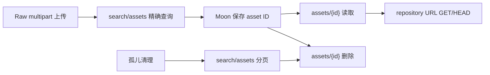

# Moon Windows 主链路 Nexus 兼容改造记录

## 1. 结论

记录日期：`2026-07-28`

本次已完成 kkRepo 侧 Moon Windows 主链路所需的 Nexus 管理 API 最小兼容实现，并补齐 Raw 资产按 ID 删除、权限、审计、稳定分页、数据库索引和跨副本缓存失效。当前结论如下：

| 项目 | 状态 | 结论 |
| --- | --- | --- |
| 代码实现 | `COMPLETE` | Moon 当前源码实际使用的 `search/assets`、asset GET/DELETE、Maven group GET 已实现 |
| 聚焦单元测试 | `PASS` | 55 tests，0 failures，0 errors，0 skipped |
| 黑盒测试编译 | `PASS` | `MoonWindowsManagementBlackBoxCompatibilityTest` 已通过 reactor `test-compile` |
| MySQL Testcontainers | `BLOCKED` | 本机无可用 Docker daemon，新增 DAO 集成用例未执行 |
| Nexus/kkRepo 双端实测 | `BLOCKED` | SIT 尚未部署本次代码，且写入/删除需要双端专用仓库和凭据 |
| 生产切换 | `NO-GO` | 历史 Nexus opaque asset ID 映射、双端写入闭环和多副本实测尚未完成 |

这里的 `代码实现完成` 不等于 `生产验收通过`。在双端 live 测试、历史 ID 迁移和多副本验证完成前，不应把 Nexus DNS 直接切换到 kkRepo。

## 2. Moon 实际调用链

证据来自公司 Sourcegraph 中 `gitlab.qunhequnhe.com/moon/moon` 的实际源码。复核时仓库 HEAD 为：

```text
0968373080789bc82338b96f3f1cac69239f1f8b
```

未使用 SDK 方法名猜测参数。`AutoDeleteWindowsArtifacts` 的完整调用实参确认只使用 `continuationToken`、`repository` 和 `name` 三类 search 参数。

| 调用位置 | 实际调用 | 业务作用 |
| --- | --- | --- |
| `api/.../WindowsConstant.java:29-30` | `GET /service/rest/v1/search/assets?repository=...&name=...` | Windows 发布结果校验、按仓库和路径定位资产；这里仍硬编码 Nexus 域名 |
| `web/.../NexusManagementService.java:61` | `GET /service/rest/v1/repositories/maven/group/{repositoryName}` | 读取 Maven group 配置 |
| 同文件 `:69` | `GET /service/rest/v1/assets/{id}` | 根据 Moon 保存的 asset ID 读取下载地址 |
| 同文件 `:77` | `DELETE /service/rest/v1/assets/{id}` | 根据 asset ID 删除资产 |
| `web/.../AutoDeleteWindowsArtifacts.java:151` | `searchAssets(... repository, ... name, ...)` | 根据制品 URL 提取 path，精确查找 Raw 资产 |
| 同文件 `:198` | `AssetsApi.deleteAsset(id)` | 删除过期资产 |
| 同文件 `:295,319,326-327` | `searchAssets(continuationToken, ... repository, ...)` | 分页扫描孤儿资产 |
| 同文件 `:304` | `AssetsApi.deleteAsset(id)` | 删除孤儿资产 |
| 同文件 `:204-219` 附近 | `HEAD {downloadUrl}` | 判断制品是否已经是 404 |
| `WindowsComponentVersionServiceImpl.java:126,140,182` | asset GET/DELETE | Windows 组件版本查询、删除和下载 |
| `WindowsComponentReleaseServiceImpl.java:185` | asset GET | Windows 发布读取下载地址 |

主链路可以归纳为：



## 3. 本次范围与兼容状态

| API/行为 | 本次处理 | 当前状态 |
| --- | --- | --- |
| `GET /service/rest/v1/search/assets` | 支持 `repository`、`name`、`continuationToken`；50 条 keyset 分页 | 代码完成，单测 PASS，双端 live BLOCKED |
| `GET /service/rest/v1/assets/{id}` | 返回 Nexus AssetXO 所需字段并执行 READ 鉴权 | 代码完成，单测 PASS，双端 live BLOCKED |
| `DELETE /service/rest/v1/assets/{id}` | Raw hosted 按数据库 ID 精确删除，补齐审计和缓存失效 | 代码完成，单测 PASS，双端 live BLOCKED |
| `GET /service/rest/v1/repositories/maven/group/{repositoryName}` | 返回 Nexus 3.27 实测字段集合 | 代码完成，单测 PASS，认证双端 live BLOCKED |
| `POST /service/rest/v1/components` | 复用已有 Raw component upload；新增公司 multipart 形状的闭环黑盒场景 | 非本次新实现，live 写入 BLOCKED |
| `GET/HEAD /repository/{repo}/{path}` | 复用现有 Raw 内容服务；闭环黑盒场景覆盖下载、checksum 和 HEAD | 非本次新实现，live 双端 BLOCKED |

明确不在本次范围内：

- `search/assets` 的 Maven 坐标、Docker、npm 等 Nexus 全量查询参数。
- 非 Raw hosted 仓库的 asset DELETE。当前明确返回 `405`，不伪装为已支持。
- Nexus 全量 Search API、Component API 和其它管理 API。
- 历史 Nexus opaque asset ID 的迁移映射，详见第 8 节。

## 4. Nexus 参考行为

参考端为 `http://10.1.11.19:8081`，已确认版本为 Nexus Repository OSS `3.27.0-03`。本次仅对参考生产 Nexus 执行只读请求，没有上传或删除生产资产。

| 场景 | Nexus 参考结果 | kkRepo 实现 |
| --- | --- | --- |
| 不存在仓库的 asset search | `200`，`{"items":[],"continuationToken":null}` | 同语义；专门锁定 null 字段序列化 |
| 非法 asset ID | `422`，空响应体 | 同语义 |
| AssetXO 字段 | `downloadUrl`、`path`、`id`、`repository`、`format`、`checksum` | 同字段集合 |
| 常见 checksum | `sha1`、`md5`，部分历史资产还有 `sha256` | 按数据库已有值返回这三类 checksum |
| Maven group GET | `name`、`online`、`storage`、`group`；3.27 响应没有 `maven` 字段 | 同字段集合，不臆造 `maven` |
| Maven group 匿名请求 | `403` | kkRepo 使用现有权限模型；认证成功路径仍需双端实测 |

Nexus 实际 asset ID 的 Base64 URL-safe 解码结构已确认是：

```text
{repositoryName}:{32 位小写十六进制 opaque value}
```

kkRepo 沿用相同外形，但内部值来自 kkRepo MySQL `asset.id`。两端都把 ID 视为 opaque；不能据此推导历史 Nexus ID 已经可在 kkRepo 使用。

## 5. 实现设计

### 5.1 Asset ID 与分页

- kkRepo asset ID 使用无 padding 的 Base64 URL-safe 编码。
- payload 为 `{repositoryName}:{32 位小写十六进制 asset.id}`。
- 解码后同时校验 repository 名称、数据库 asset ID、repository ID 和 format，避免跨仓库读取。
- continuation token payload 为 `v1:{16 位 repository.id}:{16 位 lastAssetId}`。
- token 与具体 repository 绑定；跨仓库复用返回 `400`。
- 分页使用 `(repository_id, id)` keyset，不使用 offset，避免删除或新增数据时发生大范围漂移。
- ID 和 token 不保存在 JVM 中，重启和多副本使用同一 MySQL 真相。

### 5.2 Search 行为

- `repository` 是 Moon 范围内的必填参数。
- `repository + name` 对 Raw 资产执行 path 精确查询，返回 0 或 1 条。
- 只传 `repository` 时按 `asset.id` 升序返回，每页最多 50 条。
- 只接受 Moon 已被源码证明使用的 `repository`、`name`、`continuationToken`；其它参数返回 `400`，防止把未实现参数误报为兼容。
- 不存在的 repository 返回 Nexus 同形空页。
- 已存在 repository 的查询执行 BROWSE 权限判定。

### 5.3 GET、DELETE 与生命周期

- GET 按 opaque ID 精确读取 asset 与 live blob 元数据，并执行 READ 权限判定。
- DELETE 先解析 ID、确认资产归属，再执行 DELETE 权限判定。
- DELETE 当前仅支持 Raw hosted，避免错误复用到需要协议 metadata 重建的 Maven/npm 等格式。
- 一个 MySQL 事务内删除 browse node、asset，并在 component 无资产时删除空 component。
- blob 不在线硬删除；无引用后标记为 deleted，由现有 GC 异步删除 OSS/S3 对象。
- 并发重复删除依据数据库影响行数判定，只有一个请求返回成功，不依赖 JVM 锁。

### 5.4 权限与审计

- 复用请求中已有主体，或从请求凭据认证。
- 仅在请求没有显式凭据时尝试 anonymous；错误凭据不会降级为 anonymous。
- asset search/get/delete 分别使用 BROWSE、READ、DELETE repository permission。
- Maven group GET 使用 `nexus:repository-admin:maven2:{repo}:read`。
- 请求中附加 repository 与 requested permission 上下文，供审计记录使用。
- `DELETE /service/rest/v1/assets/*` 已纳入 `ManagementAuditFilter` 非读操作审计。

### 5.5 多副本缓存语义

- MySQL asset/blob 行是业务真相，节点本地缓存只保存可重建快照。
- 写入、覆盖和删除在事务提交后失效本节点资产缓存。
- `AssetMetadataCache` 现在同时更新 MySQL `VersionWatermark`。
- 其它副本读取时比较 repository 版本；版本变化后清空该 repository 的本地资产缓存并回源 MySQL。
- 版本水位读取仍有现有本地短 TTL，用于降低 MySQL 压力；资产缓存 TTL 是漏通知时的最后兜底。
- 新增双节点单测使用两个独立本地缓存和同一个版本水位，证明写节点失效后读节点不继续使用旧快照。

### 5.6 数据库变更

新增 Flyway V35：

```sql
CREATE INDEX idx_asset_repository_id ON asset (repository_id, id);
```

MySQL 与 PostgreSQL 迁移均已增加。该索引用于 repository 范围内的 asset ID keyset 分页；不是 format 索引的重复替代。

## 6. 测试与实际结果

### 6.1 已执行：聚焦单元测试

实际执行环境：JDK `D:\jdk\jdk25`。由于本机 Maven 全局镜像不可达，测试时临时使用了 `target/codex-settings.xml` 指向公开镜像；该临时文件在任务结束前删除。

```powershell
mvn -s target\codex-settings.xml -pl server -am `
  "-Dtest=NexusAssetIdCodecTest,NexusAssetManagementServiceTest,NexusRepositoryManagementAuthorizerTest,NexusRepositoryManagementControllerTest,RawHostedServiceTest,RawAssetWriterTest,ManagementAuditFilterTest,AssetMetadataCacheTest" `
  "-Dsurefire.failIfNoSpecifiedTests=false" test
```

结果：

```text
Tests run: 55, Failures: 0, Errors: 0, Skipped: 0
BUILD SUCCESS
```

覆盖内容包括 ID/token 编解码、分页、空页 null 序列化、DTO、权限、Raw-only 删除、并发重复删除、审计和跨副本缓存版本失效。

### 6.2 已执行：黑盒测试编译

```powershell
mvn -s target\codex-settings.xml -pl compat-test -am -DskipTests test-compile
```

结果为 `BUILD SUCCESS`。这只能证明测试源码可以编译，不能记为双端 PASS。

### 6.3 未执行：MySQL 集成测试

`AssetDaoMySqlIntegrationTest.managementAssetPageUsesStableIdCursorAndJoinsBlobMetadata` 已新增，覆盖真实 MySQL 上的分页顺序和 `LEFT JOIN asset_blob`。

当前状态为 `BLOCKED`：

```text
failed to connect to npipe:////./pipe/docker_engine
```

本机没有可用 Docker daemon，也未发现可启动的 Docker Desktop/Windows 服务，因此 Testcontainers 没有运行。该测试不得记录为 PASS。

### 6.4 未执行：双端 live 闭环

黑盒类：

```text
compat-test/src/test/java/com/github/klboke/kkrepo/compat/
MoonWindowsManagementBlackBoxCompatibilityTest.java
```

已定义以下双端场景：

1. 不存在仓库 search 返回 Nexus 同形空页。
2. 非法 asset ID 双端返回 `422`。
3. 使用公司真实 Raw multipart 字段上传：`raw.directory`、`raw.asset1`、`raw.asset1.filename`。
4. 双端 upload -> exact search -> asset GET -> download -> checksum -> HEAD -> DELETE -> 删除后 GET/search。
5. Maven group DTO 与成员顺序对比。
6. finally 尝试清理 fixture。

写测试默认拒绝 `windows-artifacts`，仅允许专用 `moon-windows-compat`。只有同时显式设置以下开关才允许写生产同名仓库：

```text
COMPAT_WRITE_ENABLED=true
COMPAT_MOON_ALLOW_PRODUCTION_REPOSITORY=true
```

当前 `http://172.28.199.226:8080` 仍是未部署本次代码的 SIT。此前对旧部署的 FAIL 结果不能当作本次实现结果，本次双端状态保持 `BLOCKED`。

## 7. SIT 验收步骤

1. 构建 Spring Boot 可执行 jar：`mvn -pl server -am -DskipTests package spring-boot:repackage`。
2. 在 SIT 部署本次构建并确认 V35 Flyway migration 成功。
3. 在 Nexus 参考端和 kkRepo SIT 创建同名专用 Raw hosted 仓库 `moon-windows-compat`。
4. 为双端测试账号授予该专用仓库的 browse/read/add/edit/delete 权限；不要复用日常生产账号。
5. 配置 `NEXUS_COMPAT_BASE_URL=http://10.1.11.19:8081` 和 `KKREPO_COMPAT_BASE_URL=http://172.28.199.226:8080`，凭据仅放环境变量。
6. 设置 `COMPAT_WRITE_ENABLED=true`，运行 `MoonWindowsManagementBlackBoxCompatibilityTest`。
7. 验收 JUnit XML：三个用例必须 `0 failures / 0 errors / 0 skipped`；skip 不算 PASS。
8. 检查双端专用 fixture 均已清理；若清理失败，按测试输出的 path 手工处理。
9. 使用至少两个 kkRepo 副本执行跨节点 upload/search/delete/HEAD，确认版本水位和删除可见性。
10. 最后用 Moon SIT 执行一次真实 Windows 发布、版本读取、版本删除和孤儿清理回归。

## 8. 生产放行阻断项

### 8.1 历史 Nexus asset ID

这是当前最重要的阻断项。

Moon 会把 Nexus `AssetXO.id` 保存到自身数据库。切换后，新上传资产会保存 kkRepo 生成的 ID，可以完成 search -> GET/DELETE 闭环；但切换前已保存的 Nexus opaque ID 不能直接映射到 kkRepo MySQL `asset.id`。

现有 Nexus 迁移会保存 `sourceAssetId`，但对 OrientDB 来源它是类似 `#cluster:position` 的内部 identity，尚无证据证明它等于 Nexus REST 对外 opaque value。因此生产前必须选择并验证一种方案：

1. 迁移时从 Nexus REST asset 列表采集 public asset ID，并建立唯一的 `source public ID -> target asset.id` 映射；或
2. 在切换前批量回填 Moon 历史记录为 kkRepo 新 ID，并提供数量、遗漏和回滚报告。

在该映射闭环前，历史 Windows 版本的 GET/DELETE 不兼容，不能宣称无感切换。

### 8.2 其它必须完成项

- 在真实 MySQL 8 上执行新增 DAO 集成测试和 V35 migration 验证。
- 双端执行有效 ID 的 GET/DELETE，不只测试非法 ID。
- 双端验证超过 50 条资产的 continuation token 分页；当前只有单元测试覆盖分页。
- 使用认证账号验证 Maven group 成功 DTO、无权限 `403` 和错误凭据 `401`。
- 在双副本或多副本 SIT 验证删除后的 search、GET 和 HEAD 可见性。
- 验证审计日志包含操作者、repository、permission、path、状态和请求关联信息。
- 验证异步 blob GC 能处理已软删除且无引用的对象，不误删共享 blob。
- Moon 中 `WindowsConstant` 的硬编码 Nexus 域名仍需通过配置化或 DNS 切换方案处理；本次只实现服务端兼容能力。

## 9. 回滚原则

- 上线前保留 Nexus 写入口，不在没有历史 ID 映射和双端 PASS 时单向切 DNS。
- 灰度期间若 asset GET/DELETE、分页、权限或审计出现差异，Moon 流量回切 Nexus。
- kkRepo 已写入的资产不得只通过数据库手工删除；使用 API 或迁移/清理工具保持 asset、blob、browse node 和审计一致。
- V35 只增加索引，应用回滚时可保留；如确需删除，应在停写和查询计划评估后单独执行，不放在应用自动回滚中。

## 10. 变更文件

管理 API：

- `server/src/main/java/com/github/klboke/kkrepo/server/management/NexusAssetController.java`
- `server/src/main/java/com/github/klboke/kkrepo/server/management/NexusAssetIdCodec.java`
- `server/src/main/java/com/github/klboke/kkrepo/server/management/NexusAssetManagementService.java`
- `server/src/main/java/com/github/klboke/kkrepo/server/management/NexusRepositoryManagementAuthorizer.java`
- `server/src/main/java/com/github/klboke/kkrepo/server/management/NexusRepositoryManagementController.java`

DAO、删除、缓存与审计：

- `persistence-jdbc/src/main/java/com/github/klboke/kkrepo/persistence/jdbc/api/AssetDao.java`
- `persistence-jdbc/src/main/java/com/github/klboke/kkrepo/persistence/jdbc/internal/JdbcAssetDao.java`
- `server/src/main/java/com/github/klboke/kkrepo/server/raw/RawAssetWriter.java`
- `server/src/main/java/com/github/klboke/kkrepo/server/raw/RawHostedService.java`
- `server/src/main/java/com/github/klboke/kkrepo/server/cache/AssetMetadataCache.java`
- `server/src/main/java/com/github/klboke/kkrepo/server/security/ManagementAuditFilter.java`
- `server/src/main/java/com/github/klboke/kkrepo/server/security/SecurityManagementFilter.java`

数据库：

- `persistence-mysql/src/main/resources/db/migration/mysql/V35__asset_management_search.sql`
- `persistence-postgresql/src/main/resources/db/migration/postgresql/V35__asset_management_search.sql`

测试：

- `compat-test/src/test/java/com/github/klboke/kkrepo/compat/MoonWindowsManagementBlackBoxCompatibilityTest.java`
- `server/src/test/java/com/github/klboke/kkrepo/server/management/*Test.java`
- `server/src/test/java/com/github/klboke/kkrepo/server/raw/RawAssetWriterTest.java`
- `server/src/test/java/com/github/klboke/kkrepo/server/raw/RawHostedServiceTest.java`
- `server/src/test/java/com/github/klboke/kkrepo/server/cache/AssetMetadataCacheTest.java`
- `server/src/test/java/com/github/klboke/kkrepo/server/security/ManagementAuditFilterTest.java`
- `persistence-mysql/src/test/java/com/github/klboke/kkrepo/persistence/mysql/dao/AssetDaoMySqlIntegrationTest.java`

## 11. 状态定义

| 状态 | 定义 |
| --- | --- |
| `COMPLETE` | 代码已经实现并通过对应静态/单元验证，不代表环境验收完成 |
| `PASS` | 指定测试已实际运行，且 0 failures、0 errors、0 skipped |
| `BLOCKED` | 因部署、Docker、凭据或 fixture 缺失未实际运行，不得写成 PASS 或 FAIL |
| `FAIL` | 已实际执行并观察到与参考端不一致 |
| `NO-GO` | 至少一个生产放行阻断项尚未关闭 |
