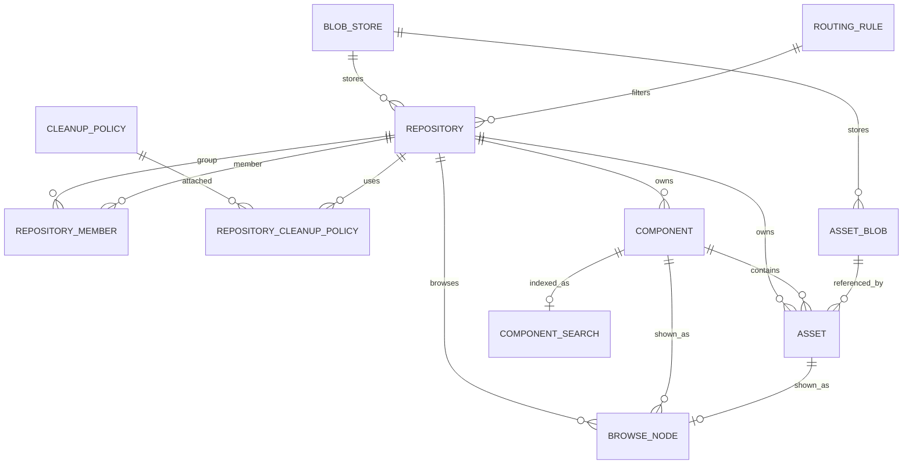
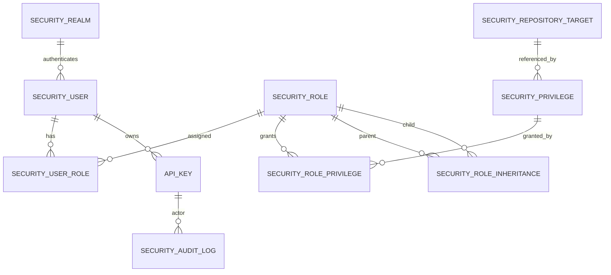

# kkrepo MySQL ER 设计

历史 MySQL schema 从 `persistence-mysql/src/main/resources/db/migration/mysql/V1__init_schema.sql` 开始；MySQL 与 PostgreSQL 之后通过成对 migration 演进，当前到 V35，并由 Flyway 在服务启动时执行。MySQL 8 使用 InnoDB；PostgreSQL 提供逻辑等价的 V29 baseline 和相同的 V30+ 变更。本文继续作为两种引擎的详细逻辑 ER 参考，另见[数据库 Schema](database-schema.md)。

Schema 对共享 asset/blob 数据采用“统一内容表 + format 字段”的模型。Cargo / Rust、Dart / Pub、Composer / PHP、Terraform、Swift 和 Ansible 使用这套共享模型，协议元数据保存在 component/asset attributes 中；Composer package/version/dist 不增加专用业务表，proxy route 也作为可重建内部 asset 保存。Pub 为官方多步骤 publish flow 增加 `pub_upload_session`。Terraform 使用 signing key、Provider revision/platform、group source binding 和 publish lease 旁表；Ansible V35 增加 collection version/signature、持久化 import task、proxy state、group binding 和带 fencing 的 lease 表，以保证跨副本一致性。Docker/OCI manifest、tag、upload session、auth token、referrers 等其它协议专有关系同样使用专用旁表。这样更适合从 Nexus 迁移和管理台统一查询；如果后续某个格式数据量明显过大，再通过分区或更多专用表优化。

## 仓库与内容 ER

## 安全与审计 ER

上图除角色/权限映射表外，`security_realm`、`security_repository_target`、`api_key` 和 `security_audit_log` 相关连线表达运行时业务关联；实际硬外键以 Flyway migration 为准。审计表不对 actor/token 建外键，避免审计数据因账号或 token 生命周期被级联影响。

## 运行时协调与迁移 ER

```mermaid
erDiagram
  REPOSITORY ||--o| PROXY_REMOTE_STATE : remote_health
  REPOSITORY ||--o{ METADATA_REBUILD_MARKER : maven_metadata_queue
  REPOSITORY ||--o{ REPOSITORY_INDEX_REBUILD_MARKER : index_queue
  REPOSITORY ||--o{ PUB_UPLOAD_SESSION : pub_upload
  REPOSITORY ||--o{ TERRAFORM_SIGNING_KEY : signs
  REPOSITORY ||--o{ TERRAFORM_PROVIDER_SIGNING_STATE : provider_revision
  REPOSITORY ||--o{ TERRAFORM_PROVIDER_PLATFORM : provider_platform
  REPOSITORY ||--o{ TERRAFORM_SOURCE_BINDING : group_source
  REPOSITORY ||--o{ ANSIBLE_COLLECTION_VERSION : collection_version
  ANSIBLE_COLLECTION_VERSION ||--o{ ANSIBLE_COLLECTION_SIGNATURE : signature
  REPOSITORY ||--o{ ANSIBLE_IMPORT_TASK : import_task
  REPOSITORY ||--o{ ANSIBLE_PROXY_VERSION_STATE : proxy_state
  REPOSITORY ||--o{ ANSIBLE_GROUP_BINDING : group_source
  REPOSITORY ||--o{ ANSIBLE_REGISTRY_LEASE : fenced_lease
  SPRING_SESSION ||--o{ SPRING_SESSION_ATTRIBUTES : has
  MIGRATION_JOB ||--o{ MIGRATION_CHECKPOINT : records
  MIGRATION_JOB ||--o{ MIGRATION_VALIDATION_RESULT : validates
  MIGRATION_JOB ||--o{ REPOSITORY_DATA_MIGRATION_REPOSITORY : migrates
  REPOSITORY ||--o{ REPOSITORY_DATA_MIGRATION_REPOSITORY : target
  REPOSITORY_DATA_MIGRATION_REPOSITORY ||--o{ REPOSITORY_DATA_MIGRATION_ASSET : contains
  COMPONENT ||--o{ REPOSITORY_DATA_MIGRATION_ASSET : target_component
  ASSET ||--o{ REPOSITORY_DATA_MIGRATION_ASSET : target_asset
  ASSET_BLOB ||--o{ REPOSITORY_DATA_MIGRATION_ASSET : target_blob
```

`cache_version`、`auth_ticket` 和 `maintenance_cursor` 是按主键独立读写的运行时协调表，不挂业务外键。

## 表分层

### 仓库配置层

| 表 | 职责 |
| --- | --- |
| `blob_store` | OSS/S3/File blob store 的逻辑定义。保留原始 attributes JSON，并抽取 endpoint/bucket/prefix 等常用字段 |
| `repository` | hosted/proxy/group 仓库定义。保留 Nexus recipe 和 attributes JSON，显式列出 format、type、online、remote URL 等 |
| `repository_member` | group 仓库成员顺序。Nexus group 语义依赖顺序，必须保留；group 仓库也有 blob store |
| `routing_rule` | proxy routing rule |
| `cleanup_policy` | cleanup policy 原始条件 |
| `repository_cleanup_policy` | 仓库和 cleanup policy 绑定关系 |
| `content_selector` | 早期 content selector 配置表；运行时授权当前以 `security_repository_target` 中的 CSEL/target 定义为准 |

### 内容元数据层

| 表 | 职责 |
| --- | --- |
| `component` | 包级元数据。各制品格式统一进入这里，`format` 保存 Nexus 协议格式名 |
| `asset` | 可下载对象或协议元数据文件，例如 jar、pom、tarball、simple index、index.yaml |
| `asset_blob` | 物理 blob 引用和 checksum；带 `deleted_at/delete_reason/delete_claimed_at` 支持软删除、GC 认领和 blob store 用量统计 |
| `browse_node` | Browse 页面树形视图。可由 `asset` 重建，但保存一份能提升 UI 查询体验；`has_asset_subtree` 用于大仓库目录查询 |
| `component_search` | SQL Search 的反范式索引表。替代老 Nexus 本地 Elasticsearch |

### 运行时协调层

| 表 | 职责 |
| --- | --- |
| `proxy_remote_state` | proxy 远端健康状态和失败计数，作为多副本共享的 circuit breaker 状态 |
| `metadata_rebuild_marker` | Maven metadata 异步重建队列，按 `(repository_id, scope_key)` 去重，worker 使用 `FOR UPDATE SKIP LOCKED` 并发领取 |
| `repository_index_rebuild_marker` | Helm/PyPI/Yum/RubyGems 等仓库级或 scoped 索引重建队列，支持失败次数和错误摘要 |
| `cache_version` | MySQL 版本水位。节点本地缓存只做热缓存，变更后 bump version，其他副本轮询后失效重载 |
| `SPRING_SESSION` | Spring Session JDBC 主表，承载跨副本 HTTP session |
| `SPRING_SESSION_ATTRIBUTES` | Spring Session 属性表 |
| `auth_ticket` | 短生命周期认证票据，按 token hash 存储并通过过期时间清理 |
| `maintenance_cursor` | 后台维护任务的共享游标，例如 blob reconcile 扫描水位 |
| `ui_settings` | 单行 UI 偏好设置表，当前用于默认语言选择 |
| `pub_upload_session` | Dart / Pub publish upload session 状态，包括 session/field token、principal、过期时间、临时 blob 引用、解析出的 package/version、checksum、size、错误和 finalized 时间 |
| `terraform_signing_key` | 加密保存 hosted Provider signing key revision 与 public key material；每个仓库选择一个 active revision |
| `terraform_provider_signing_state` | 已就绪的 Provider version revision，以及匹配的 SHA256SUMS/signature path 和 signing-key revision |
| `terraform_provider_platform` | Provider platform identity 与 archive path/checksum；按 repository/namespace/type/version/os/arch 唯一 |
| `terraform_source_binding` | 带过期时间的 group coordinate-to-member binding，保证 metadata 与 archive 读取命中同一 member/revision |
| `terraform_publish_lease` | 数据库支持的过期 lease，用于跨副本串行化 module/provider 发布 |
| `ansible_collection_version` | canonical collection coordinate、component/asset 引用、archive SHA-256、有上限的查询元数据/dependency、state、source 和 revision；完整 `MANIFEST.json`/`FILES.json` 仍只存在 artifact blob 中 |
| `ansible_collection_signature` | 绑定不可变 collection version 的可选 detached signature，按 blob/hash 引用保存 |
| `ansible_import_task` | 持久化 Galaxy publish task，包含 staging asset、requester、校验结果、claim/lease、fencing token、attempt 和时间 |
| `ansible_proxy_version_state` | 上游 discovery/detail identity、validator、预期 artifact checksum、cache/negative state 和完整性状态 |
| `ansible_group_binding` | 将 group collection version 绑定到一个有序 source member/revision/filename/checksum；proxy artifact 落地前 version 引用可为空，避免 metadata 读取提前下载 blob，同时防止 metadata 与 artifact 错配 |
| `ansible_registry_lease` | 跨副本 publish、proxy materialization/revalidation 和 takeover 使用的共享过期 lease/fencing token |

### 权限层

| 表 | 职责 |
| --- | --- |
| `security_user` | 用户和密码 hash。使用 `(source, user_id)` 保留 Nexus realm/source 语义；本地 source 当前规范化为 `Local` |
| `security_role` | 角色定义。`source` 字段保留 UI/迁移语义；本地角色当前规范化为 `Local` |
| `security_privilege` | 权限定义，`properties_json` 保留 Nexus privilege 属性；`read_only` 标识内置 contributor 权限 |
| `security_role_privilege` | 角色到权限的映射 |
| `security_role_inheritance` | 角色继承 |
| `security_user_role` | 用户到角色的映射 |
| `security_anonymous_config` | anonymous 访问配置；保留 Nexus 的 enabled、userId、realmName，并保存映射后的 `user_source` |
| `security_realm_config` | Nexus realm 顺序配置 |
| `security_realm` | local、LDAP、OIDC 三类 realm 的启用状态、名称、优先级和 provider 属性 |
| `security_repository_target` | Content selector / repository target 兼容定义，运行时用于 repository-content-selector privilege 的 CSEL 表达式匹配 |
| `api_key` | API key 兼容数据；以 `domain + api_key_hash` 对齐 Nexus 唯一语义，raw token 只以加密 payload 保存 |
| `security_audit_log` | 管理 API 和安全相关操作审计，按时间、actor、path、outcome/status、method 建索引 |

### 迁移层

| 表 | 职责 |
| --- | --- |
| `migration_job` | 一次迁移任务的输入、选项、状态和摘要 |
| `migration_checkpoint` | OrientDB RID 到目标表主键的映射，用于断点续跑和幂等导入 |
| `migration_validation_result` | 数量、checksum、抽样协议验证结果 |
| `repository_data_migration_repository` | 仓库数据迁移的仓库级进度、游标、统计、认领状态和选项 |
| `repository_data_migration_asset` | 仓库数据迁移的 asset 级任务、重试状态、源元数据和目标 component/asset/blob 引用 |

## 关键设计决策

1. `component.coordinate_hash` 由应用按 `repository + namespace + name + version` 计算 SHA-256，解决 MySQL 长字符串组合唯一索引问题。
2. `asset.path_hash` 由应用按仓库内协议路径计算 SHA-256，表达 Nexus 的 asset 路径唯一性。
3. `asset_blob.blob_ref_hash` 和 `object_key_hash` 由应用计算，避免对超长 URL/key 建唯一索引；`idx_asset_blob_reusable` 支持按 sha256/size 复用 blob，`idx_asset_blob_usage` 支持 blob store 用量统计。
4. `attributes_json` 保留 Nexus 原始属性，显式列用于高频查询。迁移阶段先保证不丢信息，再逐步收敛模型。
5. `browse_node` 和 `component_search` 是可重建表。迁移失败时不影响协议下载正确性。
6. metadata 和仓库索引重建必须通过 MySQL marker 队列协调，不能只依赖单 JVM 内存队列。多副本 worker 使用 `FOR UPDATE SKIP LOCKED` 并发领取，任务本身保持幂等。
7. 权限、仓库目录、blob store 等节点本地 catalog cache 只作为可重建热缓存；共享真相在 MySQL，跨副本失效通过 `cache_version` 水位完成。
8. HTTP session 使用 Spring Session JDBC。`auth_ticket` 只承载短生命周期登录/认证流状态，不替代 session 或 token 数据。
9. 权限模型兼容 Nexus 的 user/role/privilege 语义。运行时 repository 鉴权按 `nexus:repository-view:<format>:<repository>:<actions>`、`nexus:repository-admin:<format>:<repository>:<actions>`、`nexus:repository-content-selector:<selector>:<format>:<repository>:<actions>` 和 repository target 规则判定。
10. Maven 仓库格式在 JSON、数据库、权限和 CSEL 中统一保存为 Nexus 原生 `maven2`；历史 `maven` 值由 V11 归一化。
11. 本地安全 source 当前使用 `Local`；旧 `default` 和 Nexus realm 名在迁移、REST/UI 兼容层中归一化。
12. 空库通过 V7/V9/V10 seed Nexus 3.29.x 内置 security contributor 事实，包括应用管理权限、repository view/admin 通配权限、per-format/per-repository 动态权限、blob store 权限、默认 anonymous 用户和 anonymous 配置；幂等插入不覆盖迁移或人工修改后的同名权限内容。
13. `security_realm.attributes_json` 承载外部 provider 配置：LDAP 的 URL、bind DN、用户/组搜索配置，以及 OIDC 的 issuer、JWKS、audience、clientId/clientSecret、authorization/token endpoint、redirect URI、scope 和 claim 映射。外部 realm 认证成功后会按 source upsert 外部用户，并把 LDAP/OIDC 组名或 token roles 作为角色名参与权限判定。
14. anonymous 访问使用 `security_anonymous_config` 指定的用户身份和角色，不做绕过权限模型的全局只读放行；Nexus 默认的 `NexusAuthorizingRealm/anonymous` 映射到本地 `Local/anonymous`。
15. 迁移被视为可恢复产品功能：`migration_checkpoint` 负责配置/安全对象幂等导入，`repository_data_migration_*` 负责仓库 asset 数据迁移的 discover、claim、retry、resume 和进度统计。
16. V24 将历史 `jindo` / `jindo-oss` blob store engine 归一化为 `oss-native`；大 blob 的真相仍在 OSS/S3/File blob store，MySQL 只保存元数据、状态、索引和引用。
17. V28 增加 `pub_upload_session`，原因是 Pub publish 是多请求协议。Session 状态、临时 blob 引用、解析出的 metadata 和 finalize 状态必须能跨副本切换和重启恢复；archive 字节仍存放在 blob storage，不进入 MySQL。
18. V35 增加 Ansible Galaxy 协议状态。显式唯一约束保护不可变 collection identity；task/lease 可在进程丢失后继续；group binding 保证 metadata/checksum/artifact 来自同一成员；archive/signature 字节仍只在 blob storage。
